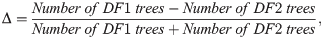
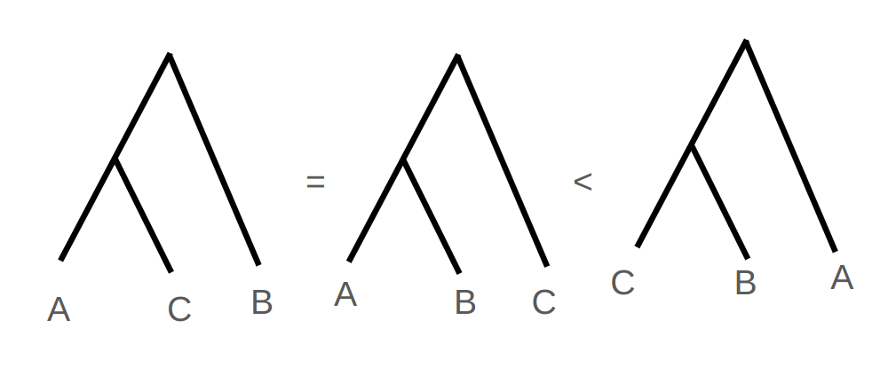
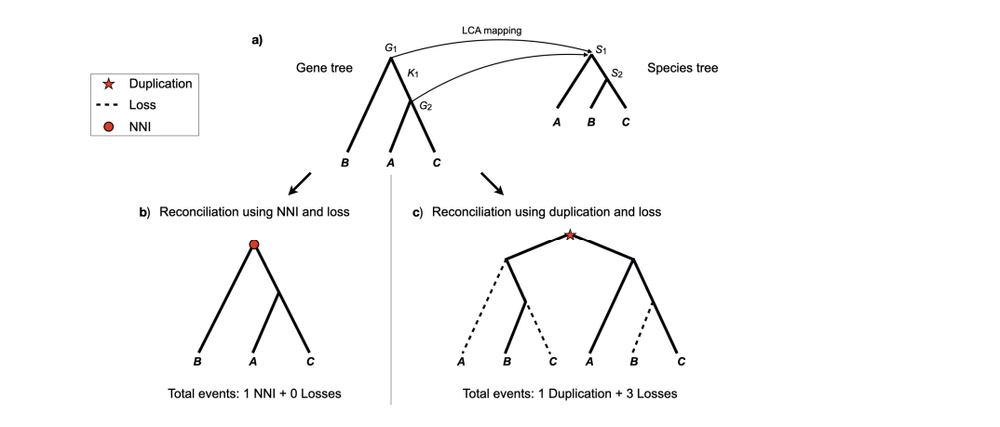
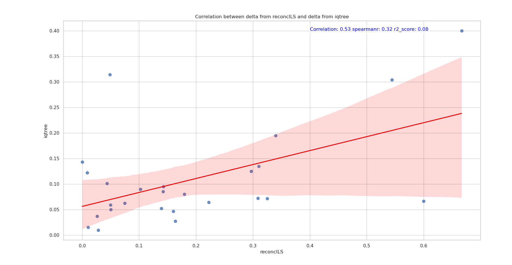
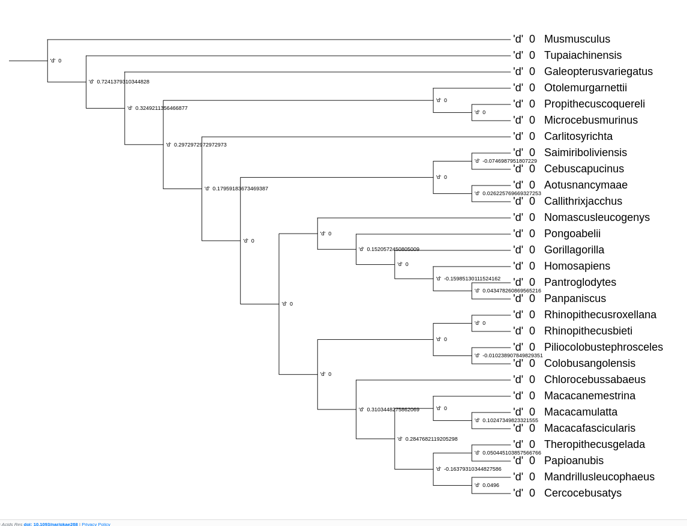
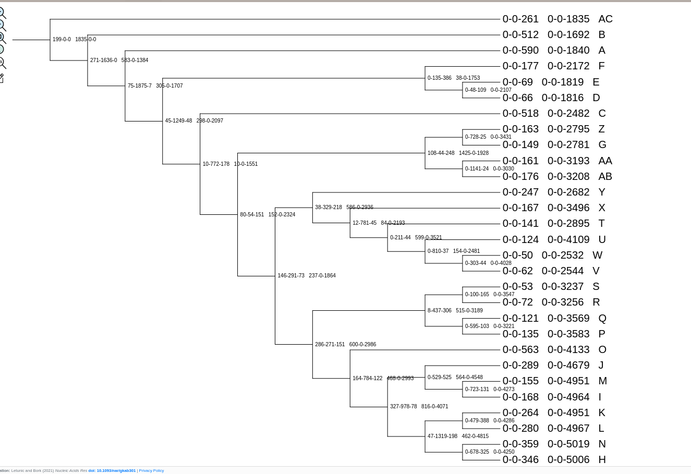

reconcILS1.1-A new tool for inferring Introgression

Introduction/Motivation

In the context of speciation, hybridization plays an important role. It
is shown to disrupt the species boundaries and changes the rate of the
speciation process. Therefore, it is very important to understand
introgression to understand speciation as a process. The possibility of
gene flow between different species can also help us determine the
geographical location of these species Abbott et al.2013 . For instance,
one may be able to infer allopatry and sympatry from introgression.
There are models such as the so-called Duplication Transfer Loss (DTL)
Menet et al.2022 which performs reconciliation of the gene tree with
events: Duplication, horizontal gene transfer, and Loss. Some methods
Chauve et al.2018 have used a reconciliation framework with DTL to
detect introgression in mosquitoes. Similarly, methods such as Pfeifer
and Kapan 2022 have proposed seeing introgression as the function of
pairwise distances. In this work, we bring a new approach to estimate
the introgression between species by leveraging gene tree species tree
reconciliation. Specifically, we use reconcILS Mishra et al.2023, a gene
tree reconciliation algorithm, to estimate introgression. reconcILS is a
method to explain the discordance of the gene tree using Duplication,
Loss, and Incomplete Lineage Sorting (ILS). reconcILS explains the ILS
with Nearest Neighbor Interchange (NNI) moves. But it is not totally
clear to us that NNI moves are caused by ILS. We can say that NNI moves
are explaining the discordance which is not Duplication and Loss. But
these discordances could be coming from anything. In particular, there
is no topological distinction between the tree permutation caused by ILS
and Introgression. Hence, we have come up with a new tool that runs off
reconcILS that performs tree introgression testing on each discordance
that reconcILS uses NNI to explain.

Method

Detecting the tree permutation due to NNI is a bit tricky. But we can
take advantage of the gene tree distribution on a multi-species
coalescent model. Under the multispecies coalescent, if the discordance
is due to ILS, then we expect the most frequent topology to be the
concordant topology and two discordant topologies to be equally
frequent. Any deviation from this assumption can be understood as some
form of gene flow between species. This is famously called the delta
statistic - a variant of Patterson's ABBA BABA test.

Delta

This is a normalized version of ABBA BABA test on trees proposed by
Huson et al. 2005. This figure is attributed to Vanderpool et al.2020

In reconcILS, we also leverage the same test to count the frequency of
discordant topologies. Statistical Assumption under Multi-species
Coalescent model. Under multi-species coalescent, the distribution of
gene trees with three species must look like figure 1 . The most
frequent gene tree topology must be concordant to the species tree. And
the frequency of two discordant topologies must be the same Maddison
1997.

Figure 1: If the species tree is (A,(B,C)), then
we expect the number of gene trees that look like (A,(B,C)) to be
greater than the other two topologies. However, if the discordance is
only due to ILS, then we expect the frequency of discordant topologies
(B,(A,C)) and (C,(A,B)) to be equal in number.

reconcILS

reconcILS is the gene tree reconciliation algorithm that combines
Duplication and Loss reconciliations with ILS. For the first step,
reconcILS performs the Last Common Ancestor mapping of the gene tree
with the species tree. Then it traverses the species tree with these
mappings and resolves each multiply mapped node with either Duplication
and Loss or NNI and Loss. In doing so, it performs a parsimonious
reconciliation of the gene tree with the species tree. If reconcILS
labels the discordant branch as duplications then we believe it as
duplication. But if reconcILS labels the discordant branch as NNIs then
we are not sure if this is caused due to ILS. We can also say the NNIs
could be due to gene flow between non-sister species. With this insight,
we have added new information to reconcILS. Before performing reconcILS
we store all the 1-NNIs in a file. For instance, a species tree of
(A,(B,C)) will have two discordant topologies, (B,(A,C)) and (C,(A,B)).
Before running reconcILS on a batch of gene trees we store these two
topologies along with the branch where the discordance can happen. In
this case, the branch is Branch leading from A to the parent of (B and
C). Then while running reconcILS on a batch of gene trees; if reconcILS
explains the discordance with NNIs then we count the topologies seen on
the gene trees.

Figure 2:a) reconcILS maps the gene tree to the
species tree using last common ancestor mapping. b) It explains the
discordant gene tree with 1 NNI move. The NNI is marked with a red dot.
c) reconcILS explains the discordant gene tree with 1 Duplication and 3
losses. The duplication is explained with a red star, and the losses are
explained with 3 dash lines.

Experiment

We ran the experiment on the Smith et al. 2022 dataset. The dataset
consists of 1835 gene trees from single-copy orthologs of primates.
There are 26 primate species and 3 outgroups. So, in this dataset, we do
not have any duplicates. This means our method reconcILS will propose
very few duplications. This is an ideal dataset to check if our new
introgression tool works well. In addition to this, we also ran
IQ-Trees2 on these gene trees. IQ-Trees2 gives the number of discordant
topologies on each branch. We also perform the delta test on the results
given by IQ-Trees2.

Expected Outcome

Ideally, our computed delta should be very close to the delta computed
from IQTree2

results.

Results We present our result in figure 4. In this figure, we present
the delta values on each node. The delta values correspond to the events
that happened on the branch above. In figure 3, we present the pairwise
correlation between the delta computed from IQTree2 results with the
delta computed from reconcILS. The deltas are absolute values because we
are not sure about the direction of shift explained by the delta
computed from IQTree.

Figure 3: Correlation between the delta calculated from reconcILS and
IQTree. The Pearson correlation coefficient is 0.53, and the Spearman
correlation coefficient is 0.32. The R² score is 0.08.

Figure 4: The species tree with the corresponding delta value. The value
represents the estimate of introgression for the branch above.

Figure 5: These are the events inferred from reconcILS and ETE3 for all
1835 single-copy orthologs. The events are labeled as Duplication from
reconcILS ↔ NNIs from reconcILS ↔ Loss from reconcILS; Duplication from
ETE3 ↔ 0 (as ETE3 performs reconciliation with just duplication and
loss) ↔ Loss inferred by ETE3. The labeling represents the events above
the node.

Discussion and Further Work

The results we have obtained are not accurate. Although a Pearson
correlation of 0.53 may be considered good, the overall result does not
look promising. There are many explanations for the lack of accuracy
from reconcILS. One of the explanations is that in reconcILS, we allow
for multiple NNI moves to explain a single multiply mapped node. This
means one NNI may not be equal to one ILS or, in this case, one
introgression event. However, while counting the frequency of discordant
topologies, reconcILS only counts the topology of the last NNI move.
This decision could be the reason behind the dip in performance. In the
future, we aim to fix this issue. We aim to develop a method to
determine which of these NNI moves are actually contributing to the ILS
or introgression. Another problem arises when we count all the NNIs when
we add the two discordant topologies recorded by our tool. Ideally, we
want to divide all the NNI moves into these two discordant topologies.
However, we see a mismatch. We are counting much fewer discordant
topologies than the number of NNIs proposed for that node. One of the
reasons could be the cost of Duplication and the cost of Loss. In
reconcILS, we assign a cost to each event. For this experiment, the cost
of Duplication and the cost of Loss was 2, whereas the cost of NNI
was 1. In our results (figure 5), we can see that some of the nodes are
still labeled with duplication. But these gene trees are created from
single-copy orthologs. This means there were multiply mapped nodes that
were too costly to resolve by NNI moves. Our guess is maybe this is
causing this discrepancy. Another reason behind the performance loss
could be our outgroups. In figure 5, we have shown the species tree with
the events inferred by reconcILS and ETE3 Huerta-Cepas et al.2016. ETE3
has a reconciliation function that performs reconciliation with only
duplication and loss. It seems keeping outgroups has affected the count
of the discordant topologies. For instance, the branch connecting
Galeopterus variegatus to our 26 species has 1636 NNIs and 271
duplications; this means our outgroup are affecting the counts of the
discordant topologies. I am currently in the process of removing these
outgroups and rerunning reconcILS on these gene trees. I expect some
changes, and hopefully, the new results will look closer to the delta
computed from IQTree2.

Conclusion

In this work, we have introduced a novel tool to detect introgression
while performing reconciliation of the gene tree with species trees.
This tool can be helpful in studying speciation. This tool blends the
classic reconciliation problem with gene flow. By creating this tool, we
aim to aid speciation research. For instance, our tool may be able to
detect ancestral introgression, which could aid in speciation. If we can
accurately pinpoint a time when gene flow between two species occurred,
researchers may look for other evidence to support the claim. This may
help discover interesting phenomena in the realm of speciation,
especially in defining species boundaries.

Reference:

[Vanderpool D, Minh BQ, Lanfear R, Hughes D, Murali S, Harris RA,
Raveendran M, Muzny DM, Hibbins MS, Williamson RJ, Gibbs RA, Worley KC,
Rogers J, Hahn MW. Primate phylogenomics uncovers multiple rapid
radiations and ancient interspecific introgression. PLoS Biol. 2020 Dec
3;18(12):e3000954. doi: 10.1371/journal.pbio.3000954. PMID: 33270638;
PMCID: PMC7738166.]{.underline}

R. Abbott, D. Albach, S. Ansell, J. W. Arntzen, S. J. E. Baird, N.
Bierne, J. Boughman, A. Brelsford, C. A. Buerkle, R. Buggs, R. K.
Butlin, U. Dieckmann, F. Eroukhmanoff, A. Grill, S. H. Cahan, J. S.
Hermansen, G. Hewitt, A. G. Hudson, C. Jiggins, J. Jones, B. Keller, T.
Marczewski, J. Mallet, P. Martinez‐rodriguez, M. Möst, S. Mullen, R.
Nichols, A. W. Nolte, C. Parisod, K. Pfennig, A. M. Rice, M. G. Ritchie,
B. Seifert, C. M. Smadja, R. Stelkens, J. M. Szymura, R. Väinölä, J. B.
W. Wolf, D. Zinner, Hybridization and speciation, Journal of
Evolutionary Biology, Volume 26, Issue 2, 1 February 2013, Pages
229--246, <https://doi.org/10.1111/j.1420-9101.2012.02599.x>

Mishra, S., Smith, M. L., Hahn, M. W. (2023). reconcILS: A gene
tree-species tree reconciliation algorithm that allows for incomplete
lineage sorting. bioRxiv 2023.11.03.565544; doi:
<https://doi.org/10.1101/2023.11.03.565544>

Chauve, C., Feng, J., Wang, L. (2018). Detecting Introgression in
Anopheles Mosquito Genomes Using a Reconciliation-Based Approach. In:
Blanchette, M., Ouangraoua, A. (eds) Comparative Genomics. RECOMB-CG
2018. Lecture Notes in Computer Science, vol 11183. Springer, Cham.
https://doi.org/10.1007/978-3-030-00834-5_9

Pfeifer, B., Kapan, D.D. Estimates of introgression as a function of
pairwise distances. BMC Bioinformatics 20, 207 (2019).
https://doi.org/10.1186/s12859-019-2747-z

Menet H, Daubin V, Tannier E (2022) Phylogenetic reconciliation. PLoS
Comput Biol 18(11): e1010621.
<https://doi.org/10.1371/journal.pcbi.1010621>

Smith, M. L., Vanderpool, D., Hahn, M. W. (2022). Using all Gene
Families Vastly Expands Data Available for Phylogenomic Inference.
Molecular Biology and Evolution, Volume 39, Issue 6, June 2022, msac112,
<https://doi.org/10.1093/molbev/msac112>

Minh, B. Q., Schmidt, H. A., Chernomor, O., Schrempf, D., Woodhams, M.
D., von Haeseler, A., Lanfear, R. (2020). IQ-TREE 2: New Models and
Efficient Methods for Phylogenetic Inference in the Genomic Era.
Molecular Biology and Evolution, Volume 37, Issue 5, May 2020, Pages
1530--1534, <https://doi.org/10.1093/molbev/msaa015>

Huson, D. H., Klöpper, T., Lockhart, P. J., Steel, M. A. (2005).
Reconstruction of reticulate networks from gene trees. Proceedings of
RECOMB 2005: The 9th Annual International Conference Research in
Computational Molecular Biology. Berlin: Springer; pp. 233--249.
<https://doi.org/10.1007/11415770_18>

Wayne P. Maddison, Gene Trees in Species Trees, Systematic Biology,
Volume 46, Issue 3, September 1997, Pages 523--536,
<https://doi.org/10.1093/sysbio/46.3.523>

Huerta-Cepas J, Serra F, Bork P. ETE 3: Reconstruction, Analysis, and
Visualization of Phylogenomic Data. Mol Biol Evol. 2016
Jun;33(6):1635-8. doi: 10.1093/molbev/msw046. Epub 2016 Feb 26. PMID:
26921390; PMCID: PMC4868116.
